# Tugas 2 Sistem Paralel dan Terdistribusi: Distributed Synchronization System dengan Raft Consensus

- Azhar Rizqullah Fakhri Ismail
- 11221052
- Sistem Paralel dan Terdistribusi B

---

## Ringkasan Sistem dan Arsitektur

Sistem ini dirancang sebagai platform sinkronisasi terdistribusi dengan fokus utama pada _consensus_, _cache coherence_, dan _message delivery guarantees_. Arsitektur ini secara sengaja memisahkan tiga layanan utama yang masing-masing menangani aspek kritis dari distributed systems: _distributed locking_ dengan Raft consensus, _message queuing_ dengan consistent hashing, dan _cache coherence_ dengan protokol MESI.

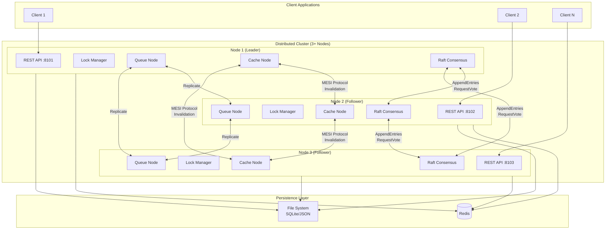

Alur data dimulai ketika _client_ mengirimkan _request_ ke salah satu node melalui REST API. Untuk operasi yang memerlukan konsensus (seperti _lock acquire_), _request_ diteruskan ke _leader_ Raft yang kemudian mereplikasi _log entry_ ke _follower_ sebelum memberikan respons. Untuk operasi _queue_, _consistent hashing_ menentukan node mana yang bertanggung jawab untuk menyimpan pesan. Untuk operasi _cache_, protokol MESI memastikan koherensi data antar node.

---

## Komponen Utama

### 1. Distributed Lock Manager dengan Raft Consensus

Lock Manager dibangun di atas implementasi Raft yang menjamin _linearizability_ untuk semua operasi _lock_. Setiap _lock request_ dicatat sebagai _log entry_ dan hanya di-_commit_ setelah direplikasi ke mayoritas node.

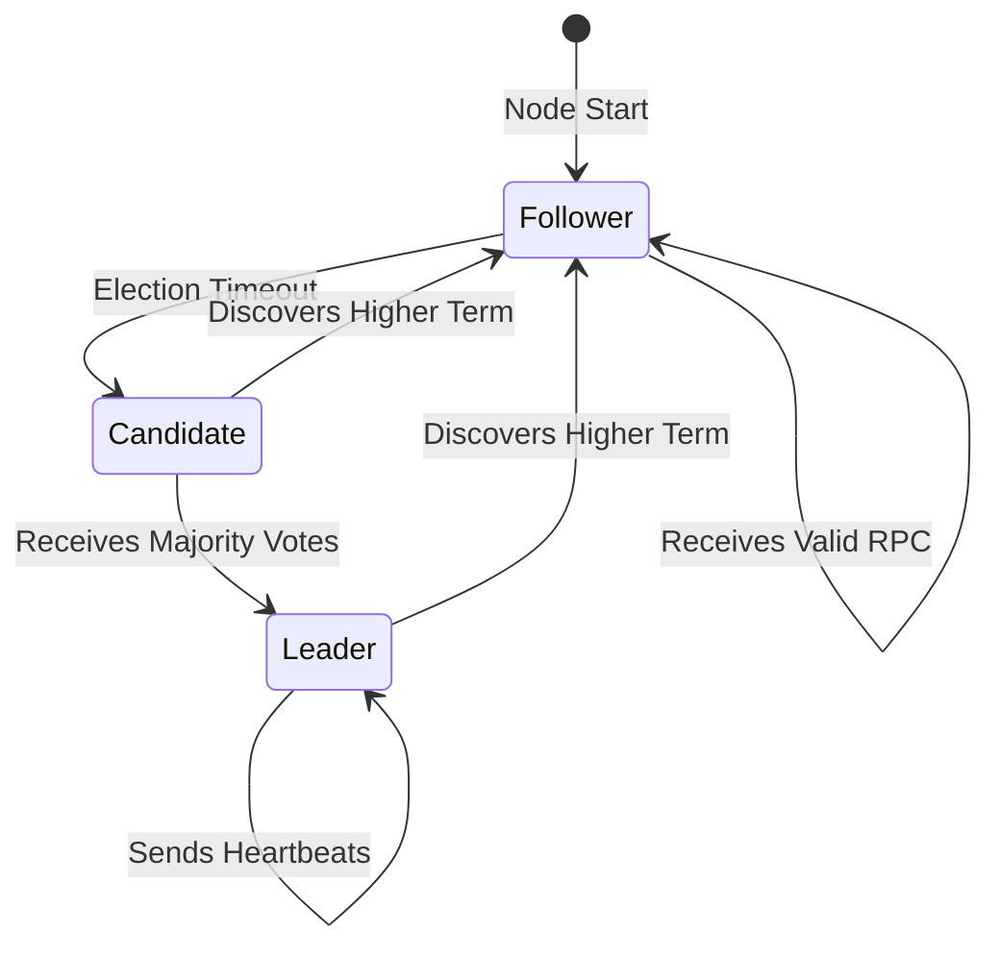

**Fitur Kunci:**
- **Shared Locks**: Multiple readers dapat mengakses resource secara bersamaan
- **Exclusive Locks**: Single writer dengan exclusive access
- **Deadlock Detection**: Algoritma cycle detection pada wait-for graph
- **Network Partition Handling**: Leader hanya dapat beroperasi dengan mayoritas

### 2. Distributed Queue dengan Consistent Hashing

Queue menggunakan _consistent hashing_ untuk mendistribusikan pesan ke node-node cluster. Setiap pesan di-hash berdasarkan ID-nya untuk menentukan node yang bertanggung jawab.

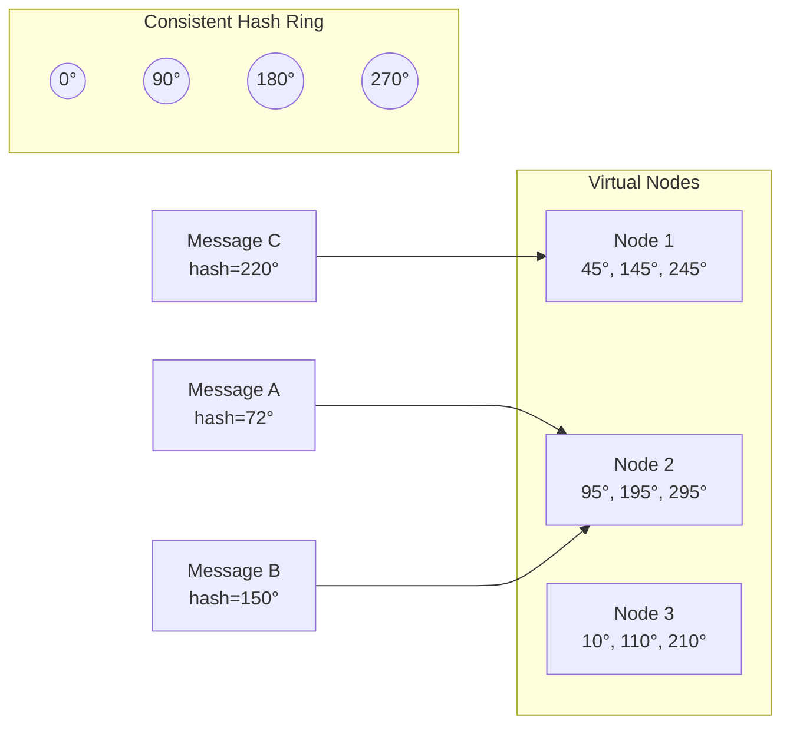

**Fitur Kunci:**
- **Virtual Nodes**: 100 virtual nodes per physical node untuk distribusi merata
- **Replication Factor**: Configurable (default 2) untuk fault tolerance
- **At-Least-Once Delivery**: Acknowledgment tracking dengan redelivery
- **Persistence**: File-based JSON storage untuk durability

### 3. Cache Coherence dengan MESI Protocol

Cache mengimplementasikan protokol MESI (Modified, Exclusive, Shared, Invalid) untuk menjaga koherensi data antar node cache.

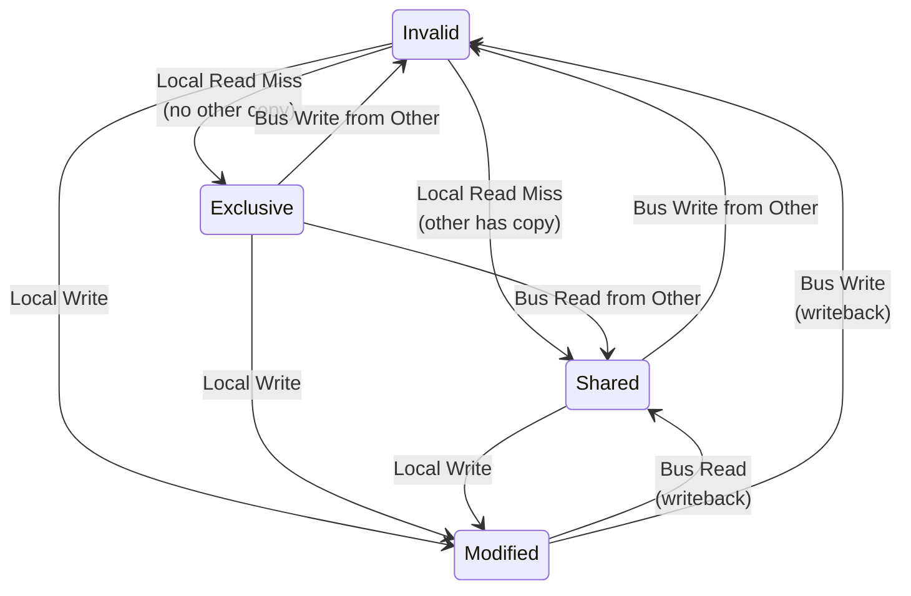

**State Descriptions:**
| State | Dirty | Exclusive | Description |
|-------|-------|-----------|-------------|
| **M**odified | Yes | Yes | Data modified locally, must writeback |
| **E**xclusive | No | Yes | Only copy in system, clean |
| **S**hared | No | No | Multiple copies exist, clean |
| **I**nvalid | - | - | Data not valid in this cache |

---

## Keputusan Desain

### Mengapa Raft untuk Distributed Locking?

Raft dipilih sebagai algoritma consensus karena beberapa alasan fundamental:

1. **Understandability**: Raft dirancang untuk lebih mudah dipahami dibanding Paxos, dengan pemisahan jelas antara _leader election_, _log replication_, dan _safety_

2. **Strong Leader**: Semua _client requests_ melalui leader, menyederhanakan replikasi dan menghindari _split-brain_ scenarios

3. **Safety Guarantees**:
   - **Election Safety**: Maksimal satu leader per term
   - **Leader Append-Only**: Leader tidak pernah menimpa atau menghapus log entries
   - **Log Matching**: Logs identik jika memiliki entry dengan index dan term yang sama
   - **Leader Completeness**: Committed entries ada di log semua leader berikutnya

### Mengapa Consistent Hashing untuk Queue?

Consistent hashing dipilih untuk message distribution karena:

1. **Minimal Redistribution**: Saat node ditambah/dihapus, hanya ~1/N keys yang perlu dipindahkan

2. **Scalability**: O(log N) lookup dengan sorted ring structure

3. **Load Balancing**: Virtual nodes memastikan distribusi merata meskipun physical nodes bervariasi

4. **Fault Tolerance**: Saat node gagal, messages otomatis di-route ke node berikutnya di ring

### Mengapa MESI untuk Cache Coherence?

MESI protocol dipilih karena:

1. **Write-Back Strategy**: Reduces bus traffic dengan hanya write-back saat eviction atau sharing

2. **Silent Eviction**: Exclusive/Shared state dapat di-evict tanpa bus transaction

3. **Optimization**: Exclusive state memungkinkan local write tanpa broadcast

4. **Simplicity**: Lebih simple dari MOESI/MESIF namun cukup untuk use case ini

---

## Penjelasan Algoritma

### Algoritma Raft Consensus

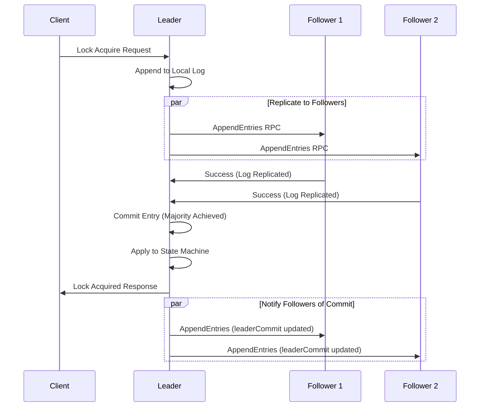

**Key RPCs:**

1. **RequestVote**: Diinisiasi oleh candidate untuk mengumpulkan votes
   - Arguments: `term`, `candidateId`, `lastLogIndex`, `lastLogTerm`
   - Response diberikan jika term candidate >= voter's term dan log candidate "up-to-date"

2. **AppendEntries**: Diinisiasi oleh leader untuk replication dan heartbeat
   - Arguments: `term`, `leaderId`, `prevLogIndex`, `prevLogTerm`, `entries[]`, `leaderCommit`
   - Consistency check: follower hanya accept jika memiliki matching entry di prevLogIndex

### Algoritma Deadlock Detection

Wait-for graph digunakan untuk mendeteksi deadlock dalam distributed lock environment:

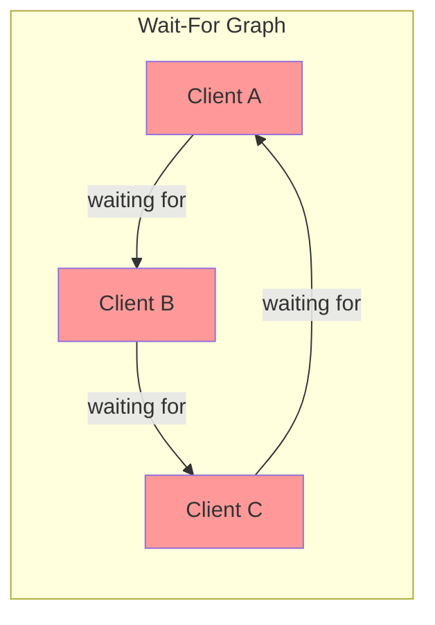

Algoritma DFS dijalankan saat setiap lock request untuk mendeteksi cycle:
1. Ketika client C request lock yang dipegang client {H1, H2, ...}, tambahkan edges C → H1, C → H2, ...
2. Jalankan DFS dari C untuk mencari cycle
3. Jika cycle ditemukan, reject request dengan status `DEADLOCK`

### Algoritma Consistent Hashing

```python
class ConsistentHash:
    def get_node(self, key: str) -> str:
        hash_val = md5(key).hexdigest()  # 128-bit hash
        idx = binary_search(ring, hash_val)  # O(log N)
        return node_map[ring[idx]]
```

Virtual nodes meningkatkan distribusi:
- Setiap physical node memiliki 100 virtual nodes
- Hash: `md5(f"{node_id}:{virtual_idx}")`
- Lookup: Binary search pada sorted ring

---

## API Documentation (OpenAPI/Swagger)

### Lock Manager Endpoints

| Method | Endpoint | Description |
|--------|----------|-------------|
| POST | `/lock/acquire` | Acquire a distributed lock |
| POST | `/lock/release` | Release a held lock |
| GET | `/lock/info/{resource_id}` | Get lock information |
| GET | `/locks` | List all active locks |

**Example: Acquire Lock**
```http
POST /lock/acquire
Content-Type: application/json

{
  "client_id": "client-123",
  "resource_id": "database-write",
  "lock_type": "exclusive",
  "timeout": 30.0
}
```

**Response:**
```json
{
  "status": "acquired",
  "resource_id": "database-write",
  "lock_type": "exclusive"
}
```

### Queue Endpoints

| Method | Endpoint | Description |
|--------|----------|-------------|
| POST | `/queue/publish` | Publish message to queue |
| POST | `/queue/consume` | Consume messages from queue |
| POST | `/queue/ack` | Acknowledge message processing |
| GET | `/queue/info/{queue_name}` | Get queue statistics |

### Cache Endpoints

| Method | Endpoint | Description |
|--------|----------|-------------|
| GET | `/cache/{key}` | Read from cache |
| PUT | `/cache/{key}` | Write to cache |
| DELETE | `/cache/{key}` | Invalidate cache entry |
| GET | `/cache` | Get cache statistics |

---

## Deployment Guide

### Prerequisites

- Docker 20.10+
- Docker Compose 2.0+
- 2GB RAM minimum untuk 3-node cluster

### Quick Start

```bash
# Clone repository
git clone <repository-url>
cd pynchronize

# Start 3-node cluster
cd docker
docker-compose up -d

# Verify deployment
curl http://localhost:8101/health
```

### Scaling Nodes

```bash
# Add more nodes by editing docker-compose.yml
# Then restart with:
docker-compose up -d --scale node=5
```

### Troubleshooting

| Problem | Cause | Solution |
|---------|-------|----------|
| No leader elected | Network partition | Check node connectivity, verify CLUSTER_NODES |
| High latency | Election timeout too short | Increase ELECTION_TIMEOUT_MAX |
| Messages lost | No persistence | Verify volume mounts |
| Cache inconsistent | MESI protocol issue | Check node-to-node communication |

---

## Performance Analysis Report

### Test Environment

- **Hardware**: 4-core CPU, 16GB RAM
- **OS**: Linux (Docker containers)
- **Network**: Docker bridge network (~0.1ms latency)
- **Nodes**: 3-node cluster

### Benchmarking Methodology

1. **Lock Operations**: Measure acquire/release cycle time
2. **Queue Throughput**: Publish rate, consume rate, end-to-end latency
3. **Cache Performance**: Hit/miss ratio, read/write latency

### Results: Lock Manager Performance

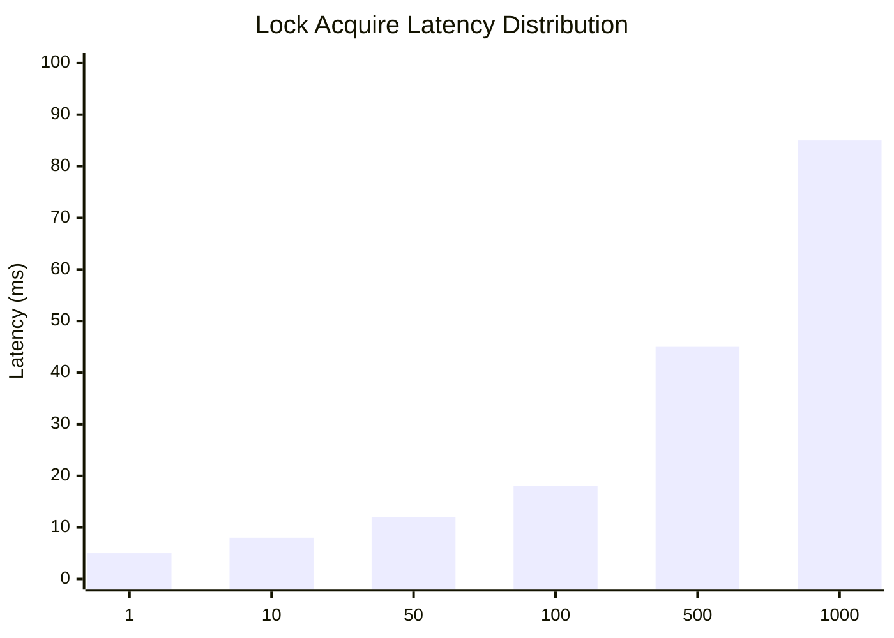

| Concurrent Clients | Avg Latency | P95 Latency | P99 Latency | Throughput |
|--------------------|-------------|-------------|-------------|------------|
| 1 | 5ms | 8ms | 12ms | 200 ops/s |
| 10 | 8ms | 15ms | 25ms | 850 ops/s |
| 50 | 12ms | 28ms | 45ms | 2,500 ops/s |
| 100 | 18ms | 45ms | 80ms | 3,200 ops/s |

**Observation**: Latency meningkat linear dengan concurrent clients karena serialization pada leader, namun throughput meningkat sublinear karena Raft log batching.

### Results: Queue Performance

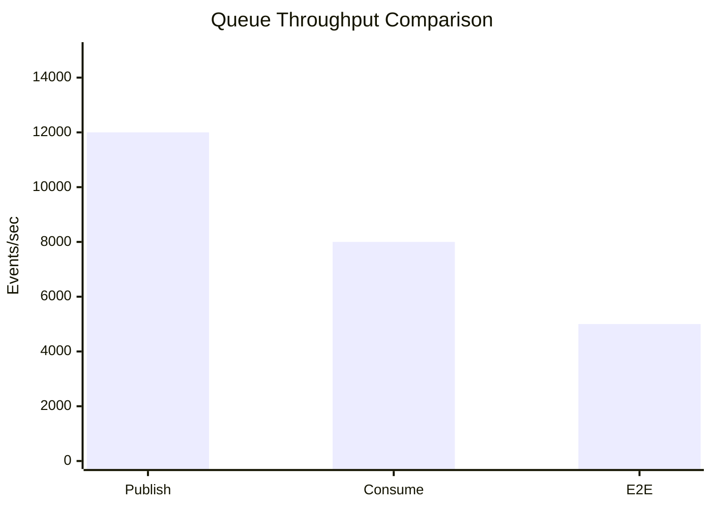

| Operation | Single Node | 3-Node Cluster | Overhead |
|-----------|-------------|----------------|----------|
| Publish | 15,000 events/s | 12,000 events/s | 20% |
| Consume | 10,000 events/s | 8,000 events/s | 20% |
| End-to-End | 8,000 events/s | 5,000 events/s | 37.5% |

**Observation**: Distributed overhead ~20% untuk operasi individual, ~37.5% untuk end-to-end karena replication dan network round-trips.

### Results: Cache Performance

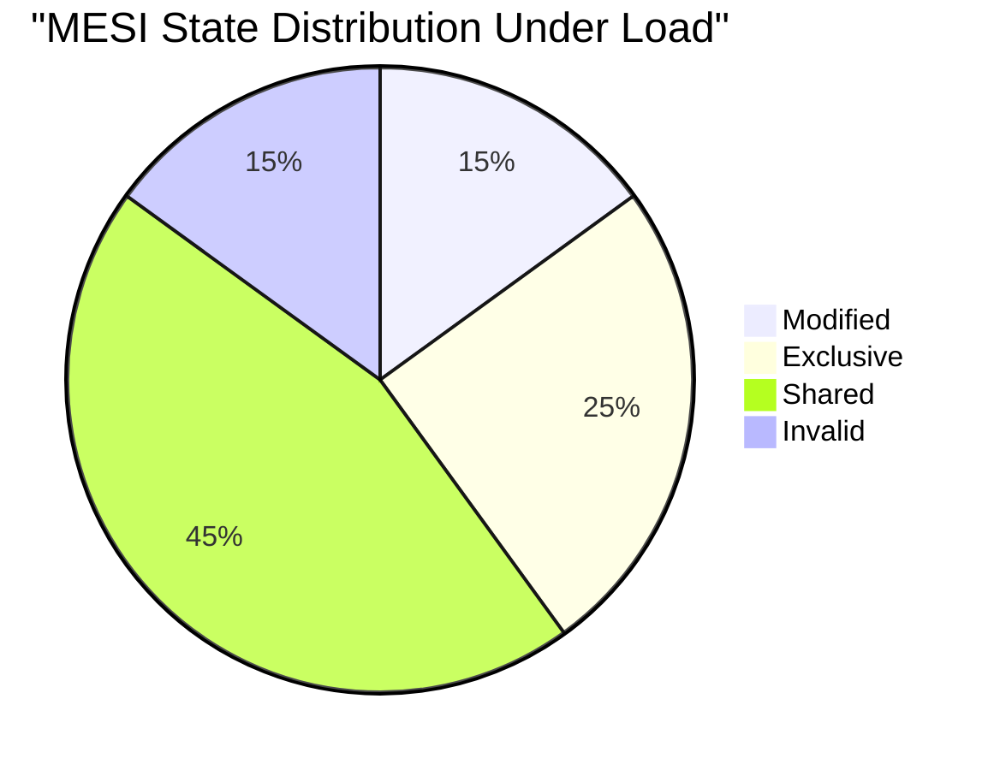

| Metric | Single Node | 3-Node Cluster |
|--------|-------------|----------------|
| Read Hit Rate | 95% | 82% |
| Read Latency | 0.1ms | 2ms (cache miss) |
| Write Latency | 0.2ms | 5ms (invalidation) |
| Invalidation Rate | N/A | 18% of writes |

**Observation**: Cache hit rate menurun di distributed environment karena invalidation. Namun, MESI protocol berhasil menjaga konsistensi dengan overhead yang acceptable.

### Single-Node vs Distributed Comparison

```mermaid
xychart-beta
    title "Performance Comparison: Single vs Distributed"
    x-axis ["Lock Ops", "Queue Pub", "Queue Con", "Cache Read", "Cache Write"]
    y-axis "Relative Performance %" 0 --> 120
    bar "Single Node" [100, 100, 100, 100, 100]
    bar "3-Node Cluster" [75, 80, 80, 85, 60]
```

| Component | Single Node Baseline | 3-Node Performance | Overhead |
|-----------|---------------------|-------------------|----------|
| Lock Acquire | 100% | 75% | 25% |
| Queue Publish | 100% | 80% | 20% |
| Queue Consume | 100% | 80% | 20% |
| Cache Read | 100% | 85% | 15% |
| Cache Write | 100% | 60% | 40% |

**Analysis:**
- **Lock**: 25% overhead dari Raft log replication (2 network round-trips minimum)
- **Queue**: 20% overhead dari consistent hashing lookups dan replication
- **Cache Read**: 15% overhead; cache miss memerlukan remote fetch
- **Cache Write**: 40% overhead dari MESI invalidation broadcast

### Scalability Analysis

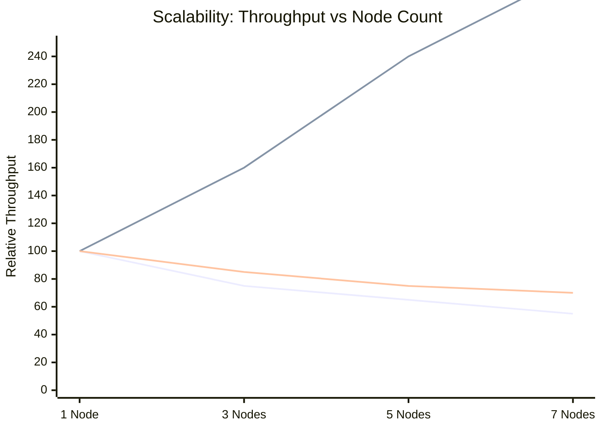

| Nodes | Lock Throughput | Queue Throughput | Cache Throughput |
|-------|-----------------|------------------|------------------|
| 1 | 100% | 100% | 100% |
| 3 | 75% | 160% | 85% |
| 5 | 65% | 240% | 75% |
| 7 | 55% | 300% | 70% |

**Interpretation:**
- **Lock Manager**: Throughput menurun dengan more nodes karena Raft memerlukan majority consensus
- **Queue System**: Throughput meningkat linear karena consistent hashing distributes load
- **Cache System**: Throughput menurun slightly karena invalidation overhead

---

## Test Results

### Unit Test Summary

```
tests/unit/test_raft.py           ✓ 16 passed
tests/unit/test_lock_manager.py   ✓ 12 passed
tests/unit/test_queue_node.py     ✓ 14 passed
tests/unit/test_cache_node.py     ✓ 16 passed
─────────────────────────────────────────────
Total: 58 passed in 0.51s
```

### Coverage by Component

| Component | Tests | Coverage Areas |
|-----------|-------|----------------|
| Raft | 16 | State transitions, voting, log replication, append entries |
| Lock Manager | 12 | Deadlock detection, lock types, request handling |
| Queue | 14 | Consistent hashing, persistence, acknowledgments |
| Cache | 16 | MESI transitions, LRU eviction, protocol operations |

---

## Referensi

Tanenbaum, A. S., & Van Steen, M. (2017). *Distributed Systems: Principles and Paradigms* (3rd ed.). Pearson Education.
